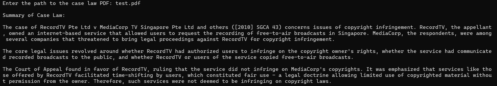

# Lexlynx - OpenAI Case Law Summarization 📚⚖️

Lexlynx is an OpenAI wrapper designed to summarize case law. It uses the `fitz` library to read PDF files, OpenAI's API to generate summaries, and `tqdm` for a progress bar during processing. Lexlynx makes legal case summarization easy and efficient! 🚀

<div align="center">
  </img>
</div>

## Features ✨
- **PDF Text Extraction**: Extracts and summarizes case law from PDF files 📄.
- **Chunking**: Breaks large PDFs into manageable chunks for processing 📊.
- **AI Summarization**: Uses OpenAI's GPT-4 model to generate concise summaries, highlighting key legal issues, judgments, and precedents 🧠💡.
- **Progress Bar**: Displays a progress bar during the summarization process using `tqdm` ⏳.

## Requirements 🛠️

To use this tool, you will need to install the following dependencies:

```bash
pip install fitz pymupdf
pip install tqdm
pip install --upgrade openai
```

## Usage 🏃‍♂️💨
```
python lexlynx.py
```

Input the PDF file name when prompted, the script will process the PDF, summarize the content, and output the summary of the case law.

Note ⚠️:
Make sure to replace "your_openai_key_here" with your actual OpenAI API key. 🔑
