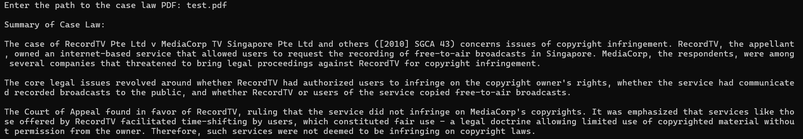

# Lexlynx - OpenAI Case Law Summarization 📚⚖️

Lexlynx is an OpenAI wrapper designed to summarize case law. It uses the `fitz` library to read PDF files, OpenAI's API to generate summaries, and `tqdm` for a progress bar during processing. Lexlynx makes legal case summarization easy and efficient! 🚀

<div align="center">
  </img>
</div>

## Features ✨
- **PDF Text Extraction**: Extracts and summarizes case law from PDF files 📄.
- **Chunking**: Breaks large PDFs into manageable chunks for processing 📊.
- **AI Summarization**: Uses OpenAI's GPT-4 model to generate concise summaries, highlighting key legal issues, judgments, and precedents 🧠💡.
- **Progress Bar**: Displays a progress bar during the summarization process using `tqdm` ⏳.

## Requirements 🛠️

```bash
pip install -r requirements.txt
```

This installs PyMuPDF (`pymupdf`), the OpenAI client and `tqdm`. Don't `pip install fitz`: that is an unrelated
package that breaks PyMuPDF.

## Usage 🏃‍♂️💨

With OpenAI (set your key in the environment, never in the code):

```bash
export OPENAI_API_KEY=sk-...        # PowerShell: $env:OPENAI_API_KEY = "sk-..."
python lexlynx.py judgment.pdf
python lexlynx.py judgment.pdf --model gpt-4o --output summary.md
```

Free and local, with [Ollama](https://ollama.com) or any other OpenAI-compatible server:

```bash
python lexlynx.py judgment.pdf --base-url http://localhost:11434/v1 --model qwen3:14b
```

| Option | Default | |
| --- | --- | --- |
| `--model` | `$LEXLYNX_MODEL`, else `gpt-4o-mini` | Chat model |
| `--base-url` | `$OPENAI_BASE_URL` | OpenAI-compatible endpoint |
| `--output` | | Also save the summary to a file |
| `--chunk-size` | `8000` | Characters per chunk |

Long judgments are split at paragraph breaks, each chunk is summarised, and the chunk summaries are combined
into one summary under the headings Case, Facts, Issues, Holding, Reasoning and Precedents.

Note ⚠️: a language model can misstate details (in testing, one summary reversed which party paid costs).
Check every summary against the judgment before relying on it.
